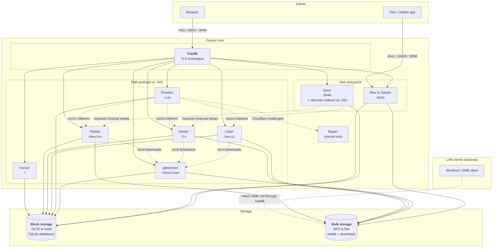

# Architecture

How the stack fits together, and why it is shaped this way.

## Topology



## The storage split — the decision that matters most

Two directories, two very different jobs:

**`DOCKERCONFDIR`** holds application config _and databases_. Every \*arr app is
SQLite-backed. So is Homarr. This directory **must live on block storage** — a
local disk or an iSCSI LUN.

**Never put it on NFS.** File locking over NFS is not reliable enough for
concurrent writes. The failure mode is not a clean error; it is a corrupted
database, usually noticed weeks later.

**`DOCKERSTORAGEDIR`** holds the media library and downloads. Large files, one
writer, no locking requirements. NFS is a good fit and the obvious choice if
your library lives on a NAS.

```bash
./scripts/install.sh --config-dir=/mnt/iscsi/appdata --data-dir=/mnt/nfs/media
```

### One filesystem for media and downloads

`DOCKERSTORAGEDIR` is mounted into every app at the same path, `/data`, with
`media/` and `torrents/` beneath it. This is deliberate: it lets the \*arr apps
**hardlink** a completed download into the library instead of copying it. A
hardlink is instant and uses no extra space; a copy doubles your disk usage and
takes as long as the file is large.

Split them across separate mounts and you silently lose this. It is the single
most common misconfiguration in stacks like this one, and the reason the
[TRaSH Guides](https://trash-guides.info/Hardlinks/) devote a whole section to it.

## Routing

Traefik terminates TLS for everything and routes by path where it can.

Some applications tolerate living under a subpath — the \*arr apps take a
`URLBASE` setting, and the compose file sets it to match the route. Others
insist on owning `/`. Rather than fight that, those get their own TLS
entrypoint:

| Entrypoint | Holds `/`        | Why                                   |
| ---------- | ---------------- | ------------------------------------- |
| `:443`     | Homarr           | Dashboard is the natural landing page |
| `:8443`    | Plex or Jellyfin | Neither works reliably under a prefix |
| `:8446`    | Seerr            | No base-URL/subpath support at all    |

Adding a service that needs `/` means adding an entrypoint, not fighting router
priorities.

### Seerr: redirect, not a path prefix

Seerr doesn't merely prefer `/` the way Plex/Jellyfin do — it has **no**
base-URL or subpath support whatsoever, only subdomains. This was confirmed
directly, not just from its docs: an uninitialized instance responds to
`GET /` with `307 Location: /setup` — a root-relative redirect. Traefik's
`stripPrefix` middleware only rewrites the incoming request path, never a
response's `Location` header, so a `/discover` path-prefix approach sends the
browser to `https://host/setup`, outside any `PathPrefix(`/discover`)` router,
and breaks on the very first request. Every client-side route and asset fetch
afterwards would hit the same problem — this isn't specific to `/setup`.

So Seerr gets its own entrypoint like Plex/Jellyfin, `:8446`, with nothing
stripped or rewritten. For convenience, `:443/discover` is a plain `302`
(via `redirectregex`, `service: noop@internal` — no backend is ever reached)
to `https://<host>:8446/`, preserving anything after `/discover` (e.g.
`/discover/movie/123` → `:8446/movie/123`). That's a full browser
navigation to a new origin, not a reverse proxy, so none of the Location-header
problem applies to it.

### The escaping trap

Traefik configuration arrives two ways, and `$` means different things in each:

- In a **Compose label**, `$` must be doubled to `$$`, because Compose performs
  variable interpolation first.
- In a **file-provider YAML**, a single `$` is correct. Doubling it there is a
  literal `$$` and the regex silently never matches.

The original version of this repo had `$$` in a file-provider document, which is
why the Portainer redirect never worked. Both forms are in use here — labels in
`compose/compose.yml`, file provider in `config/traefik/dynamic/`.

### Self-signed TLS

`install.sh` generates a self-signed certificate with the server's IP in the
subjectAltName, so browsers accept it after one warning rather than refusing
outright. Backends are reached over plain HTTP inside the Docker network, or
over their own self-signed certificates — hence `insecureSkipVerify` on the
proxy's server transport. That is deliberate, not an oversight: the traffic
never leaves the host.

Swap in a real certificate by replacing `cert.crt` and `cert.key` in
`${TRAEFIK_DIR}/certificates` and restarting the proxy.

## Media server selection

Plex and Jellyfin are both defined in `compose/compose.yml`, each behind a
[Compose profile](https://docs.docker.com/compose/profiles/). `COMPOSE_PROFILES`
in `.env` decides which one exists.

This beats the alternatives. Separate compose files would mean every script
call needs the right `-f` chain and something has to remember which. Generating
a compose file at install time would mean the repo no longer contains what is
actually running. A profile is one word in one file.

Both config directories persist independently, so switching is reversible.

## Why there is no Watchtower

The original stack ran Watchtower with no scope and no notifications: every
image, including Plex, updated itself whenever upstream published. That trades
a real risk — a broken release landing unattended at 3am, mid-library-scan —
for the convenience of not typing a command.

Instead, every image is pinned to an explicit tag in `.env`, and `update.sh` is
the moment updates happen. You get a reproducible install, a rollback path (put
the old tag back, re-run), and the ability to update one service at a time.

## Why there is no monitoring stack

An earlier version of this repo carried a Prometheus + Grafana stack — two
services, a scrape config, a dashboard provisioning tree and an auth
middleware, all to answer one question: _is anything down?_ That was later
replaced with Uptime Kuma, then dropped again: most operators running a stack
like this already have monitoring somewhere else on the homelab, and a second,
stack-local instance answering the same question is redundant rather than
convenient. If you want it, Uptime Kuma (or anything else) is a five-line
addition to `compose/compose.yml`, and the Traefik metrics endpoint is still
there to scrape either way.

## Why Byparr is not exposed anywhere

Byparr solves Cloudflare's JS challenge on Prowlarr's behalf, the same role
FlareSolverr used to fill. Nothing outside this stack ever needs to talk to
it directly — only Prowlarr does, over the internal `traefik` network — so it
carries no `traefik.enable` label and publishes no port, the same treatment as
`docker-proxy`. `configure.sh` registers it with Prowlarr automatically.

## Why the SMB share is not a container

See [file-sharing.md](file-sharing.md) for the full reasoning: in short,
`DOCKERSTORAGEDIR` is a bind mount, so the files already live at a real host
path, and Windows Network Browser visibility needs genuine LAN broadcast that
Docker's default bridge network does not pass through. It is installed and
managed by `install.sh --smb` the same way Docker itself and `avahi-daemon`
are — a host-level daemon, not a compose service.

## Idempotence

Every script is safe to re-run. Each install phase checks whether its work is
already done; `configure.sh` looks up each entry by name before creating it.

This matters more than it sounds. It means a failed install can simply be run
again, a half-configured stack can be completed rather than rebuilt, and
changing one setting does not require tearing anything down.
