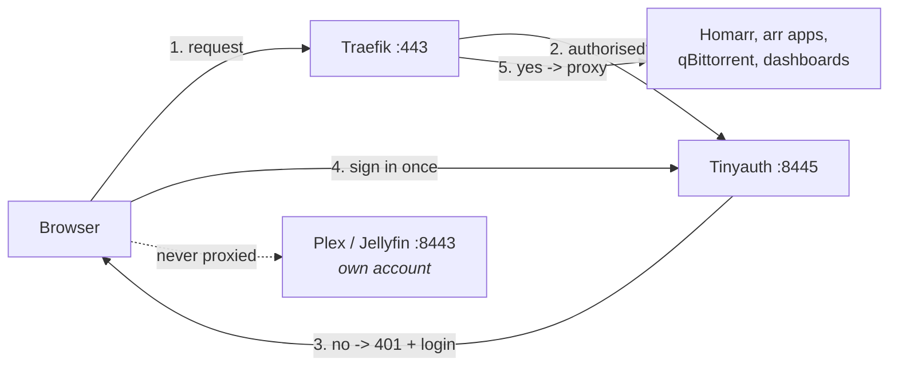

# Authentication

Choose at install time with `--auth`, or answer the prompt:

```bash
./scripts/install.sh --auth=sso    # one login for everything
./scripts/install.sh --auth=none   # no login on the LAN
```

Switching later is the same command again — it is one file swap and a profile
change, not a rebuild.

## What the stack looked like before

Eight separate credentials: four arr apps, qBittorrent, Homarr, Uptime Kuma, and
the media server — and the Traefik dashboard, which can rewrite your routing, had
no authentication at all.

## SSO (recommended)

One account covers everything reached through the proxy on `:443`:

| Behind the single login | Keeps its own account |
|---|---|
| Homarr `/` | Plex or Jellyfin `:8443` |
| Radarr `/movies` | Uptime Kuma `:8444` |
| Sonarr `/tv` | |
| Lidarr `/music` | |
| Prowlarr `/idx` | |
| qBittorrent `/download` | |
| Traefik dashboard `/admin` | |
| Portainer `/docker` | |

The media server is excluded deliberately: Plex and Jellyfin client apps cannot
complete a browser login flow, so putting them behind forward auth would break
every TV and phone app. They already sit on their own entrypoint, so the
exclusion falls out of the existing routing.

### Requirement: a resolvable hostname

Tinyauth v5 **will not accept an IP address** for its own URL — it exits with
`ip addresses not allowed`. It also rejects single-label names such as
`mediabox`, and public-suffix domains, which includes anything under
`home.arpa`.

So SSO needs a dotted hostname your devices can resolve to this machine:

| Works | Does not |
|---|---|
| `media.lan` | `10.0.20.61` — IP address |
| `media.internal` | `mediabox` — single label |
| `gamingpc.lan` | `media.home.arpa` — public suffix |

`install.sh` checks this before writing anything and asks for a hostname if the
detected one will not do, rather than letting Tinyauth fail with a cryptic
bootstrap error later.

Point the name at the server in whichever of these you already run:

- a DNS entry on your router, or its DHCP host table
- Pi-hole, AdGuard Home, or another local resolver
- `/etc/hosts` on each client, as a last resort

The generated TLS certificate includes `DOMAIN_NAME` in its subjectAltName, so
the hostname works for HTTPS without a second certificate.

**`--auth=none` has no such requirement** and continues to work over plain IP.

### How it works

[Tinyauth](https://github.com/tinyauthapp/tinyauth) (~46 MB) runs on its own TLS
entrypoint at `:8445` and Traefik asks it about every request to a protected
route. Unauthenticated requests get a 401 and a redirect to the login page; once
you have a session cookie every route opens.

Cookies ignore port numbers, so one login on `:8445` is honoured on `:443` too.



### Why the apps stop asking too

Two things, both automated:

- The arr apps are set to `AuthenticationMethod=External` with
  `AuthenticationRequired=DisabledForLocalAddresses`, which tells them the proxy
  handles authentication. These are applied as environment variables in the
  compose file. They never appear in `config.xml` — do not go looking there.
- `configure.sh` tells qBittorrent to trust the Docker network Traefik reaches it
  over, so it does not prompt a second time. It publishes no ports, so this does
  not widen access beyond whatever guards `/download`.

### Credentials

`install.sh` creates one account, `admin`. You are asked for a password, or one
is generated if you press enter or run non-interactively.

The password is never printed. If generated, it is written to a file for you to
read once:

```bash
cat /mnt/docker/appdata/tinyauth/initial-password && rm /mnt/docker/appdata/tinyauth/initial-password
```

Tinyauth reads its user list and cookie secret from files rather than environment
variables, for two reasons: a bcrypt hash is full of `$` that Compose would try
to interpolate, and anything in the environment shows up in `docker inspect`.

To change the password, delete `users` in that directory and re-run
`./scripts/install.sh`.

## None

No login on the LAN for the arr apps or qBittorrent. Homarr, Uptime Kuma and the
media server still have their own accounts — neither option removes those, so
this gets you from eight credentials to three rather than to zero.

Be clear about what this means: anything that can reach this machine's address
can add, delete and download whatever it likes, and can reconfigure the proxy.
That is reasonable on a network you control and nobody else uses. It is a poor
idea if the box is ever port-forwarded, or the network is shared with guests or
devices you do not administer.

## Switching between them

```bash
./scripts/install.sh --auth=sso
./scripts/install.sh --auth=none
```

Both are re-runnable. Existing SSO credentials are kept, so switching to `none`
and back does not make you create a new account.

Under the hood every protected router references a middleware called `auth@file`,
which `install.sh` writes into Traefik's config directory — forward auth for
`sso`, a no-op for `none`. The middleware has to exist in both modes, because a
router pointing at a missing middleware is dropped by Traefik and its route
404s. Traefik watches that directory, so the swap applies without a restart and
without touching a single router.

## If you lock yourself out

Tinyauth going down takes the protected routes with it — they will return 502 or
401. Recovery does not require the login:

```bash
./scripts/install.sh --auth=none    # drop back to no auth
docker logs tinyauth                # then find out what went wrong
```

The media server on `:8443` and Uptime Kuma on `:8444` are unaffected either way,
since neither is behind the proxy's auth.
